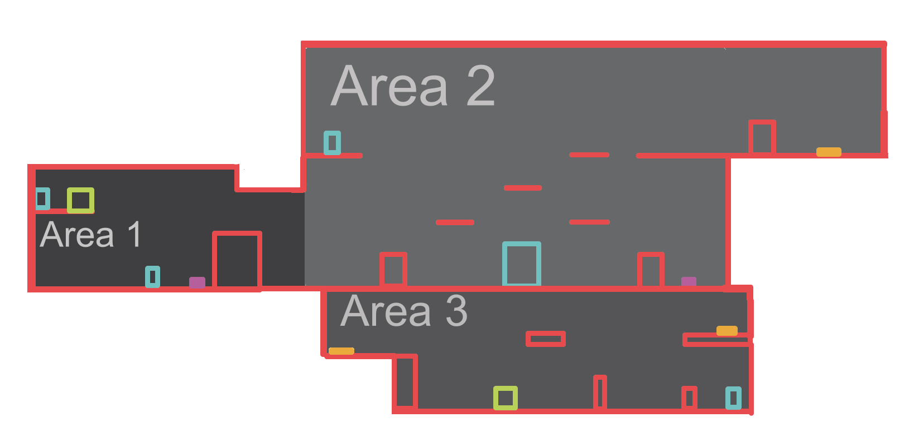

# GDD

## Description

2D Action Platform game, where the Player is in control of Naomi, an archeologist that was sent to investigate an ancient cave looking for a disappeared colleague. She will discover some hostile creatures in this cave. And some Ancient Technology that doesn't look Ancient at all.

## Story

Naomi is a space archeologist, she has been assigned a task. Investigate one ancient cave discovered on a nearby planet. Also, investigate what happened to a colleague that was sent to investigate the same cave but did not come back or answer any status report.

## Player Actions

| **Actions**        | **Keys, Buttons**                     |
| ------------------ | ------------------------------------- |
| UI Actions         |                                       |
| *Select*           | W, A, S, D, Mouse Hover               |
| *Close Pause Menu* | Esc                                   |
| *Action*           | Enter, Mouse Left Click when hovering |
| Gameplay Actions   |                                       |
| *Lateral Movement* | A, D                                  |
| *Jump*             | Space                                 |
| *Crouch*           | S                                     |
| *Attack*           | Mouse Left Click                      |
| *Run*              | Hold Shift                            |
| *Interact*         | E                                     |
| *Weapon Selection* | 1, 2                                  |
| *Open Pause Menu*  | Esc                                   |

## Mechanics

1. ### Player

   1. ### Life

      The Player has a life based on a numeric value

      **Custom Values:**

      Int | Player Max Life

   2. ### Damage

      The Player can be damaged by enemies. Reducing her Life amount by 1.

      After receiving damage, the player becomes invulnerable.

      When the Life gets to 0, the player dies.

   3. ### Invulnerability

      The Player will not receive damage for an amount of time.

      **Custom Values:**

      Float | Invulnerability Amount Time

   4. ### Death

      When the life of the Player gets to 0, the Player dies.

      Transition to the Game Over Menu.

   5. ### Movement

      [Action: *Lateral Movement*] The Player move left or right.

      **Custom Values:**

      Float | Movement Speed

   6. ### Run

      [Action: *Run*] The Player moves faster by a multiplier amount.

      **Custom Values:**

      Float | Run Multiplier

   7. ### Jump

      [Action Hold: *Jump*] The Player Jump upwards by a custom amount.

      **Custom Values:**

      Float | Jump Force

   8. ### Jump Release

      [Action Release: *Jump*] The Player can reset the Jump by releasing the Jump Action. This causes the Player to stop going upwards. Or do nothing if the Player is falling.

   9. ### Crouch

      [Action: *Crouch*] The Player crouch down. Reducing her hitbox.

   10. ### Push Boxes

       The Player can move boxes by moving against them.

       The player can not Run while pushing against a box.

   11. ### Inventory

       The Player has a small Inventory to store the keys.

   12. ### Attack

       [Action: *Attack*] The Player does an action based on the current weapon she is carrying. The attack has a delay between consecutive attacks.

       **Custom Values:**

       Float | Attack Delay Time

   13. ### Weapons

       1. ### Range Weapon

          [Action: *Weapon Select 1*] By pressing the Key 1, the Player can select this weapon as the current weapon.

          Action: The Weapon spawns a Bullet. Facing the same direction as the Player.

       2. ### Melee Weapon

          [Action: *Weapon Select 2*] By pressing the Key 2, the Player can select this weapon as the current weapon.

          Action: The Player does an attack in front of her. Dealing damage to any enemy in front of her.

       3. ### Bullet

          The Bullet travel in a straight line. It will destroy itself when hitting a wall, an object, an enemy, or after an amount of time. If it impacts an enemy, it will deal damage.

2. ### Enemies

   1. ### Enemy 01

      The Enemy has life based on a numeric value.

      It moves left to right when the Player is not nearby.

      It does a placage to the Player's last position when she is on sight.

      If hit the Player, will jump back and wait an amount of time before the next attack.

      If on hit, will wait an amount of time before the next attack 

      **Custom Values:**

      Int | Max Life

      Float | Attack Delay

   2. ### Enemy 02

      Same as Enemy 01.

      Weak to melee attacks, resists Bullets.

      **Custom Values:**

      String | Debility Tag

   3. ### Boss

      The Boss has life based on a numeric value.

      Its weakness will change depending on its State

      States

      - Receive damage from melee attacks.
      - Receive damage from Bullets.

      Attacks:

      - Melee, when the Player is in front of it.
      - Range, When the Player is far.

      It will move left and right following the Player.

      Its behavior will be random between attacking or moving towards the Player and will have a delay between each action.

      **Custom Values:**

      Int | Max Life

      Float | Actions Delay

3. ### Environment

   1. ### Doors

      [Action: *Interact*]  If the door is closed. Open the door if the Player has the correct key in her Inventory.

      If the door is open. Teleport the Player to another door linked with this one.

   2. ### Keys

      [Action: *Interact*] Pick up the key.

   3. ### Boxes

      The Boxes will move when the Player pushes against them.

   4. ### Moving Platforms

      The Platform move left and right.

      The Platform can be linked to a switch, If the switch activates, the Platform will start moving. And if it is not linked to a switch, will always move.

      Custom values:

      Float | Moving distance.

   5. ### Pressure Plate

      When the Player stands in it, activates any Moving Platform.

   5. ### Normal Platforms

      Platform suspended in the air.

   7. ### Floor

4. ### UI

   1. ### Main Menu

      Options:

      * Start Game: Load the game scene.
      * Options: Open Options Menu
      * Credits: Display credits.
      * Exit: Close the game.

   2. ### Options Menu

      Allow the player to change the resolution of the game.

   3. ### Pause Menu

      [Action: *Open/Close Pause Menu*]

      Options:

      * Resume: Closes the Pause Menu and resumes the game.
      * Exit: Back to the Main Menu.

   4. ### Thank You Menu

      The menu is shown when the Player defeats the Boss.

      Options:

      * Exit: Back to Main Menu.

   5. ### Game Over Menu

      Displayed when the Player dies. Will open the Main Menu after a few seconds.

   6. ### GUI Life

      Display the current life of the player.

   7. ### GUI Inventory

      Display the current keys that the player already collects.

   8. ### GUI Boss Life

      Will display the current life of the Boss once the Boss appears on the map.

5. ### Level Design

   1. ### Area 1

      Tutorial level, used to teach the Player how to Move, Jump, Pick Up Keys and use Doors

   2. ### Area 2
   
      Boss fight Area.
   
      Here the Player will find the Melee Weapon.
   
   3. ### Area 3
   
      This area will have Enemies.
   
      Here the Player activates the Boss fight.

## Milestones

### M1 [X]

* Configure the Project
* Configure Sprites
* Configure Unity TileMap

### M2 [X]

* Player
  * Movement
  * Run
  * Jump
  * Jump Release

* Environment
  * Floor

* Debug Level

### M3

- Player
  - Attack
  - Weapons
    - Range
    - Bullet
    - Melee
  - Weapon Pickup
- Dummy Enemy
  - Life

### M4

- Enemy01
- Enemy02
- Player
  - Life
  - Damage
  - Invulnerability
  - Death
- UI Main Menu
  - Start Game
  - Exit
- Game Over
- GUI Player Life

### M5

- Level Design
  - Area 1
- Environment
  - Doors
  - Keys
  - Boxes
- Player
  - Push Boxes
  - Inventory
- GUI Inventory

### M6

- Level Design
  - Area 2
- Environment
  - Normal Platforms
  - Moving Platforms
  - Pressure Plate

### M7

- Level Design
  - Area 3
- UI Main Menu
  - Options
  - Credits
- UI Options
- UI Credits
- UI Pause Menu
  - Resume
  - Exit

### M8

- Boss
- GUI Boss Life
- UI Thank You

